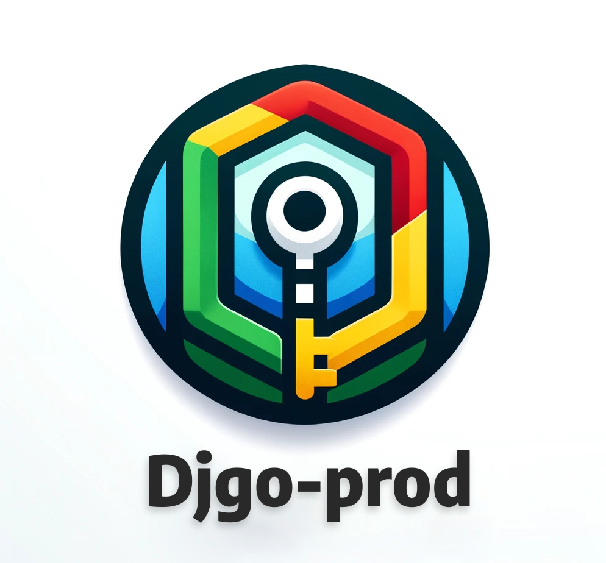
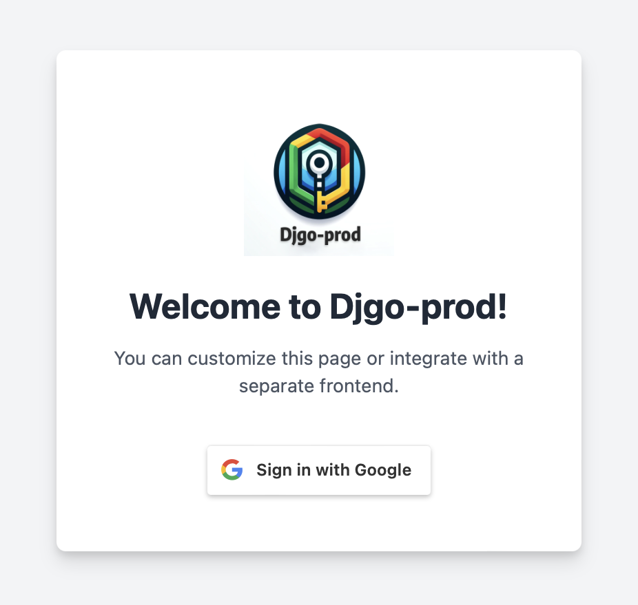

# Djgo-prod: Django Google OAuth Template Designed for Production

  

## Motivation

There are many open source Django boilerplate templates, but they are often outdated, bloated, overly complex, or lack important features for use in production. The motivation for this project was to create an intuitive boilerplate that contains all the essential features to start a production-ready Django backend app with authentication: Google OAuth2, optional PostgreSQL database, whitenoise for static files, dockerization, and three configurable deployment environments.

## Features

- 🔒 Simple and Secure Auth: With Google OAuth, you do not need to manage login, logout, reset password, or confirm email logic or pages. It also provides a faster user experience than traditional authentication.
- 🔄 Password Support: Since the app uses Django and stores users in your database, you can easily add password support at any time after launch.
- 💾 Flexible Database Options: Use a local SQLite database or a PostgreSQL database with just one line in your .env file.
- 🛡️ Static File Management: Whitenoise is configured to prevent static file issues during runtime and deployment.
- 🐳 Docker Integration: Easily run the project and collaborate across different computer environments with Docker.
- 🚀 Seamless Deployment: Switch between debugging in local, testing in development, and deploying in production without modifying settings.py.

Djgo-prod is powerful because it makes everything simple.

# Getting Started

## Step 1: Prepare Repository

Within the entire repository, replace "djgoprod" with your project name. This includes the .env examples in this README.md file as well as the name of the "djgoprod" folder, in addition to all the file contents.

## Step 2: Prepare Environment Variables

### Required Variables

Before you can deploy the application, you must first set your environment variables. This includes Google Oauth, deepgram, and OpenAI API keys. You can use the environment variables as a list of required steps for setting up the project.

### Local Deployment

For deploying the application locally, the following environment variables are required:

------- [local.env] --------

DEPLOYMENT=local  
DJANGO_SETTINGS_MODULE=djgoprod.settings
SECRET_KEY=\<add here\>
LOCAL_SQLITE=localdb
GOOGLE_CLIENT_ID=\<add here\>  
GOOGLE_SECRET_KEY=\<add here\>  

### Deployment Deployment

For deploying the application to a development environment, the following environment variables are required:

------- [development.env] --------

DEPLOYMENT=development  
DJANGO_SETTINGS_MODULE=djgoprod.settings  
SECRET_KEY=\<add here\>  
PSQL_DATABASE_URL=\<add here\>  
ALLOWED_HOSTS=\<add here\>  
GOOGLE_CLIENT_ID=\<add here\>  
GOOGLE_SECRET_KEY=\<add here\>  

### Production Deployment

Finally, deploying the application to a production environment requires the following environment variables:

------- [production.env] --------

DEPLOYMENT=production  
DJANGO_SETTINGS_MODULE=djgoprod.settings  
SECRET_KEY=\<add here\>  
PSQL_DATABASE_URL=\<add here\>  
ALLOWED_HOSTS=\<add here\>  
GOOGLE_CLIENT_ID=\<add here\>  
GOOGLE_SECRET_KEY=\<add here\>  

---

### Descriptions of Variables

After selecting your deployment environment, the list of environment variables functions as a to-do list for setting up the project. Below are instructions for each variable.

#### DEPLOYMENT

The DEPLOYMENT variable is required for all deployments and is self explanatory; It can be set to local, development, or production.

#### DJANGO_SETTINGS_MODULE

The DJANGO_SETTINGS_MODULE variable is required for all deployments and does not need to be customized. It should be set to djgoprod.settings.

#### SECRET_KEY

The SECRET_KEY variable is required only for development and production deployments, as a hard-coded insecure key is used for local. The secret key is a requirement of Django applications and used for security. The key is typically 50 characters long, with a diverse set of letters, digits, and special characters. There are several generators that can be found online, or you can generate one by running the following command:

~~~
python -c 'import secrets; print(secrets.token_urlsafe(38))'
~~~

#### LOCAL_SQLITE

The LOCAL_SQLITE variable is required only for local deployments. It could be used for staging or production instead of a PostgreSQL database. LOCAL_SQLITE defines the name before the .sqlite3 extension of the local database used.

#### PSQL_DATABASE_URL

The PSQL_DATABASE_URL variable is required only for development and production deployments, as local deployment uses an SQLite database. PSQL_DATABASE_URL should include a PostgreSQL database with the username, password, host, port, and database name in the URL.

#### ALLOWED_HOSTS

The ALLOWED_HOSTS variable is a comma-seperated list of strings representing the allowed hosts for the Django app. This is required only for development and production deployments, as allowed hosts is set to "*" in local. An example for development is the following: ALLOWED_HOSTS=localhost,127.0.0.1,exampledev.railway.app

#### GOOGLE_CLIENT_ID and GOOGLE_SECRET_KEY

The GOOGLE_CLIENT_ID and GOOGLE_SECRET_KEY are required for all deployments. In order to configure Google Oauth, you may consult the following link: https://support.google.com/googleapi/answer/6158849?hl=en. Authorized JavaScript origins for local deployment should include "http://127.0.0.1:8000". Authorized redirect URIs for local deployment should include "http://127.0.0.1:8000/allauth/google/login/callback/". For development and production deployments, "http://127.0.0.1:8000/" should be replaced with deployment URL.

### Next Steps

Once you have set all the variables in a file named {deployment}.env (e.g. local.env, development.env, production.env), you can move to the next step. Using docker is recommended, but instructions for deployment without docker are included.

If you are deploying the app to production or a different port from 8000, you will need to modify the callback_url in accounts/urls.py to match your url.

## Step 3: Run With Docker

### To build the docker image
~~~
docker build -f Dockerfile -t djgoprod:latest .
~~~

### Run docker image in same directory as env file
~~~
docker run --env-file {DEPLOYMENT}.env -p 8000:8000 djgoprod:latest
~~~
DEPLOYMENT = local, development, or production. Run with -d for detached.

The application is now up and running! You can check the status of the deployment for any errors in the logs.

  

## Step 3 Alternate: Run Without Docker

### To create virtual env
~~~
python -m venv venv
~~~

### To activate virtual env
~~~
source venv/bin/activate
~~~

### To install libraries
~~~
pip install -r requirements.txt
~~~

### Set environment variables
~~~
touch {DEPLOYMENT}.env
~~~
DEPLOYMENT = local, development, or production

~~~
export $(cat {DEPLOYMENT}.env | xargs)
~~~

### Check status for production
~~~
python manage.py test
python manage.py check --deploy
~~~

### Initialize or update database
~~~
python manage.py makemigrations accounts
python manage.py migrate accounts
~~~
~~~
python manage.py makemigrations
python manage.py migrate
~~~

### Collect static files
~~~
python manage.py collectstatic
~~~

### Create superuser (optional)
~~~
python manage.py createsuperuser
~~~

### Run server with Uvicorn
~~~
uvicorn djgoprod.wsgi:application
~~~

### Run server with Gunicorn running Uvicorn Workers
~~~
gunicorn --bind 0.0.0.0:8000 --workers 4 -k uvicorn.workers.UvicornWorker djgoprod.wsgi:application
~~~

The application is now up and running! 

  

## Contributing

If you're interested in contributing to these repository, you can fork this repository and implement your changes there. Then, you can create a pull request to the main repository. Your contributions are greatly appreciated!

## Release History

v0.1.0-alpha - First version released

### Future features

You can make requests for new features under issues or contribute code.

Current list:
- Coming soon